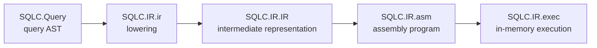

# SQLC

`SQLC` is an experimental relational-query compiler written in Haskell. It represents queries as a typed syntax tree, derives a lower-level intermediate representation (IR), translates that IR into a small assembly-like program, and executes the program against an in-memory machine. The implementation is part of the `hs-stlcc` library and is exposed through the Cabal package configuration.[1]

> **Status:** This is an exploratory implementation rather than a production SQL engine. In particular, CSV parsing and hash-join schema derivation are not yet implemented, and file loading currently provides an empty in-memory table.

## Pipeline

The compilation path is deliberately explicit. `SQLC.Query` models relational operations, `SQLC.IR.ir` lowers a query to IR while projecting only needed fields, and `SQLC.IR.asm` converts the IR to executable assembly. `SQLC.IR.exec` runs that assembly with isolated state for emitted records and predicate evaluation.[2] [3]



| Layer | Primary module | Responsibility |
|---|---|---|
| Data model | `SQLC.Core` | Defines column names, schemas, values, records, tables, and typed identifiers. |
| Query language | `SQLC.Query` | Defines scans, projections, filters, joins, grouping, expansion, counts, predicates, and qualified aliases. |
| Terms | `SQLC.Term` | Defines value, record, and Boolean-condition terms used by the IR. |
| Compiler IR | `SQLC.IR.IR` | Represents scans, emissions, predicates, hash-table construction and scans, expansion, counts, and value bindings. |
| Runtime | `SQLC.IR.Asm` | Builds, evaluates, and executes the assembly language on an in-memory `Machine`. |
| Examples | `SQLC.Top` | Contains a sequence of illustrative query constructions and lowering runs. |

## Query operations

The query AST supports the following operations.[2]

| Constructor | Meaning |
|---|---|
| `ScanFile columns path` | Scans a named file using the declared column schema. |
| `ProjectAs sources targets query` | Selects source columns and renames them to target columns. |
| `Filter predicate query` | Retains records matching a conjunction or comparison predicate. |
| `Join left right` | Combines the records produced by two subqueries. |
| `GroupBy columns tag query` | Builds an in-memory hash table keyed by `columns`, then exposes the grouped records under `tag`. |
| `Expand tag query` | Flattens the records held in a grouped table into qualified fields. |
| `Count tag countColumn query` | Adds the number of records in the table under `tag` as `countColumn`. |
| `as tag query` | Qualifies the selected query’s output fields with `tag`, which is useful before a join. |

The `Query` module supports `Eq`, `Ne`, `Ge`, `Le`, and `And` predicates. String literals represent field references in predicate positions; use `Query.Val` to express a literal value.[2]

## Example

The following example mirrors the join pattern in `SQLC.Top`. It aliases two filtered streams, joins them, retains matching identifiers, and projects the output fields to `ID` and `Age`.[4]

```haskell
{-# LANGUAGE OverloadedStrings #-}

import qualified SQLC.Core  as SQL
import qualified SQLC.Query as Query

source :: Query.Query
source = Query.ScanFile
  [("Name", SQL.String), ("Age", SQL.I32), ("City", SQL.String)]
  "<filepath>"

notKaze :: Query.Query
notKaze = Query.Filter (Query.Ne "ID" (Query.Val "Kaze")) source

adult :: Query.Query
adult = Query.Filter (Query.Ge "Maturity" (Query.Val 18)) source

joined :: Query.Query
joined = Query.ProjectAs ["L.ID", "L.Maturity"] ["ID", "Age"] $
  Query.Filter (Query.Eq "L.ID" "R.ID") $
    Query.Join (Query.as "L" notKaze) (Query.as "R" adult)
```

To inspect the generated IR and assembly for a query, use the top-level lowering helper:

```haskell
import qualified SQLC.Top as SQLC

main :: IO ()
main = SQLC.lower "joined query" joined
```

The current `Load` instruction returns an empty table; consequently, the example demonstrates compilation and execution structure but does not yet read the referenced file.[3]

## Building

The package uses `hpack` to generate `hs-stlcc.cabal` from `package.yaml`. From the repository root, build the library with Cabal:[1]

```bash
cabal build
```

The package declares `alex` and `happy` as build tools and lists its Haskell dependencies in `package.yaml`; ensure those tools are available in the environment before building.[1]

## Current limitations

| Area | Current state |
|---|---|
| CSV input | `SQLC.CSV.toRecordList` is declared but not implemented. |
| File scans | The assembly interpreter’s `Load` instruction returns an empty table instead of reading from the file system. |
| Hash join | The `HashJoin` query constructor exists, but its schema derivation is unfinished. |
| Error handling | Several lowering and evaluation paths rely on partial matches or explicit runtime errors when invariants are violated. |

## References

[1]: ../../package.yaml "hs-stlcc package configuration"
[2]: Query.hs "SQLC query AST and schema derivation"
[3]: IR/Asm.hs "SQLC assembly language and interpreter"
[4]: Top.hs "SQLC query examples"
